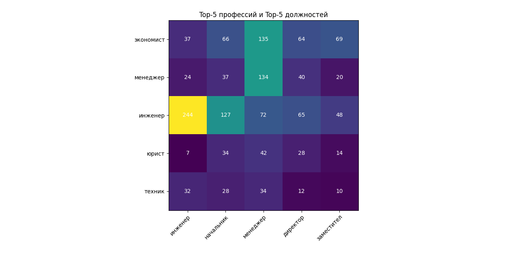

# Отчет
### Результаты по вопросам:
* У какого количества людей профессия и должность не совпадают?
* Люди с каким образованием становятся менеджерами (топ-5)?
* Кем работают люди, которые по диплому являются инженерами (топ-5)?

### Построенная с помощью matplotlib таблица (top-5 профессий и top-5 должностей):

